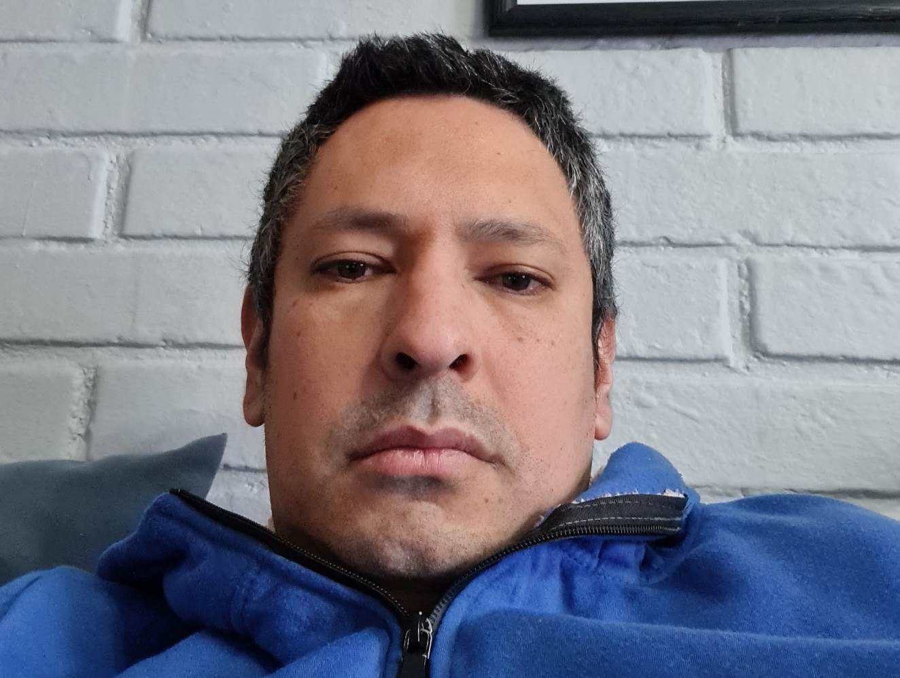

  
  
  <h1>👋 Hola, soy Fernando Valenzuela Ibarra</h1>

  

    <strong>Technical Lead | Ingeniero Software Senior | +20 años descifrando el lenguaje de las máquinas</strong>
  

  
  

    Profesional orientado a resultados, con la madurez necesaria para gestionar proyectos de gran escala y la agilidad para aprender nuevos modelos de negocio rápidamente. No solo construyo sistemas; me apasiona entender cómo la tecnología puede simplificarnos la vida.
  

---

### 💻 Perfil Técnico
- 🧠 **Capacidad Analítica:** Experto en resolución de problemas complejos.
- 🏢 **Vínculo Técnico-Negocio:** Especialista en procesos de Salud/Vida, Sistemas Municipales y Facturación Electrónica.
- 🚀 **Evolución Constante:** Proactivo y capacitado permanentemente sobre tecnologías emergentes frente al cambio constante.

---

### 💼 Experiencia Destacada

**Technical Lead / Ingeniero Software @ VidaCamara**
> *Liderando la modernización de sistemas legados, integrando tecnologías modernas con plataformas core para asegurar la continuidad operativa en la administración de pólizas, facturación y enrolamiento.*

**Analista Desarrollador @ Ecert Chile**
> *Desarrollador back-end en Portal Group, plataforma de flujo secuencial de firma digital de documentos.*

**Desarrollador Senior @ Partnertech Solutions (AMF Logistic)**
> *Líder de TI en sistemas de facturación electrónica, pago a proveedores y recepción SGR.*

**Otras experiencias clave:** Analista de Sistemas en **CAS Chile SA** (sistemas municipales), Coordinador de Explotación en **Actionline SA**.

---

### 🎓 Educación y Certificaciones

**Educación Formal**
- 🎓 Ingeniería en Ejecución en Informática, Instituto Profesional Duoc UC
- 🎓 Programación en Computación, Centro Educacional Santa Rosa

**Certificaciones**
- 🦀 [Curso completo del lenguaje Rust (Udemy - 2026)](https://www.udemy.com/certificate/UC-0af66768-d0bc-4b13-96fa-6e84c6d3e5a2/)
- 🏗️ [Arquitectura Software Moderna: DDD, Eventos, Microservicios (Udemy - 2025)](https://www.udemy.com/certificate/UC-9f0d1fe1-13ae-4af6-ab6c-800b15435afc/)
- 🔍 [Monitor and Log with Google Cloud Operations Suite Skill Badge (Credly - 2025)](https://www.credly.com/badges/fc1046ab-a565-4d8e-8442-74a6ea5fb953)
- 🔥 [Develop Serverless Apps with Firebase Skill Badge (Credly - 2025)](https://www.credly.com/badges/508a147b-1078-41f6-901d-447391b32257)
- ☁️ [Develop Serverless Applications on Cloud Run Skill Badge (Credly - 2025)](https://www.credly.com/badges/5c33bd68-5302-4062-8594-6dd264a48c10)
- ⚙️ [Scrum Master Esencial: Fundamentos Sólidos y Efectivos (Udemy - 2021)](https://www.udemy.com/certificate/UC-b87679b3-71c8-4cac-855d-4464f4c1abc6/)

---

### 🏕️ Más Allá del Código

Para mantener la mente aguda y el espíritu equilibrado:
- 📈 **Estrategia y Riesgo:** El mercado de valores me ha enseñado paciencia, análisis frío y cálculo de riesgos.
- ⚽ **Cancha y Equipo:** Futbolero que vive el trabajo en equipo y la disciplina que te obliga a estar en el aquí y el ahora.
- 📚 **Aprendizaje y Narrativas:** Consumidor constante de conocimientos técnicos y viajero a través de la buena ciencia ficción.
- 🌲 **Refugio en el Sur:** Construyendo mi espacio ideal en los lagos del sur de Chile; un proyecto personal paso a paso para priorizar la pesca, la calma y los asaditos en familia y con amigos.
